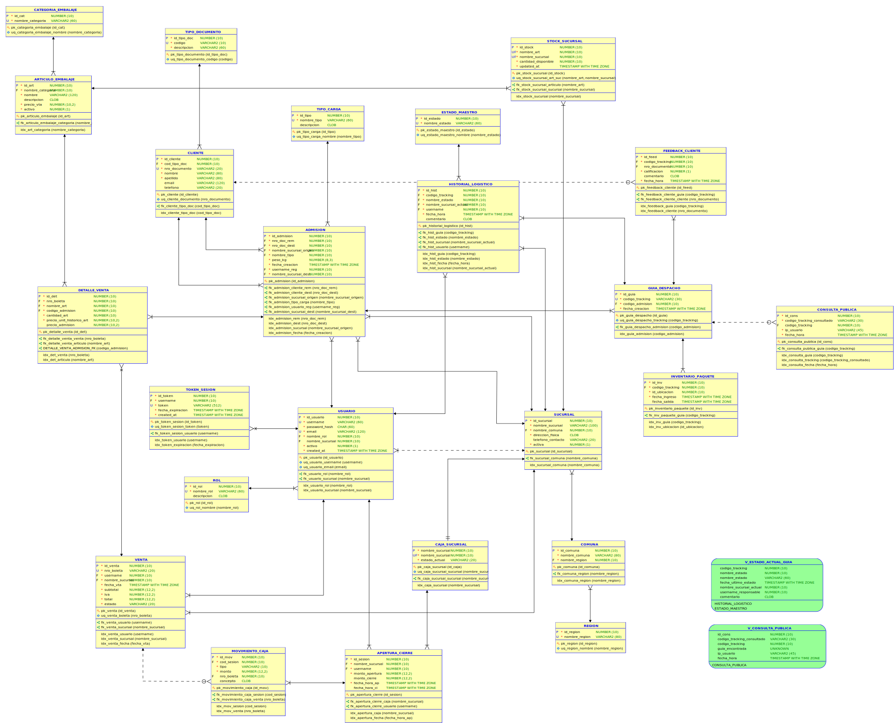
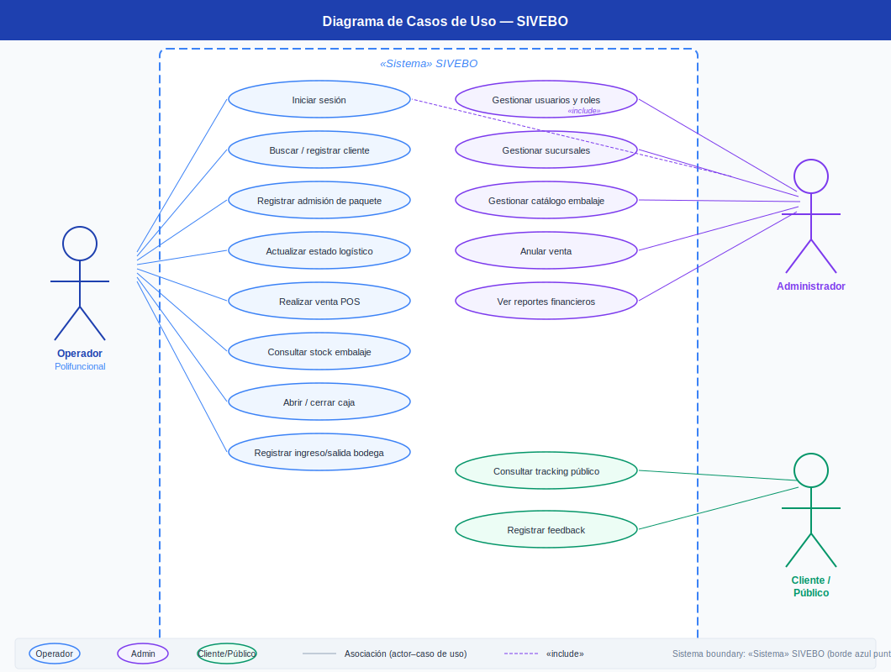
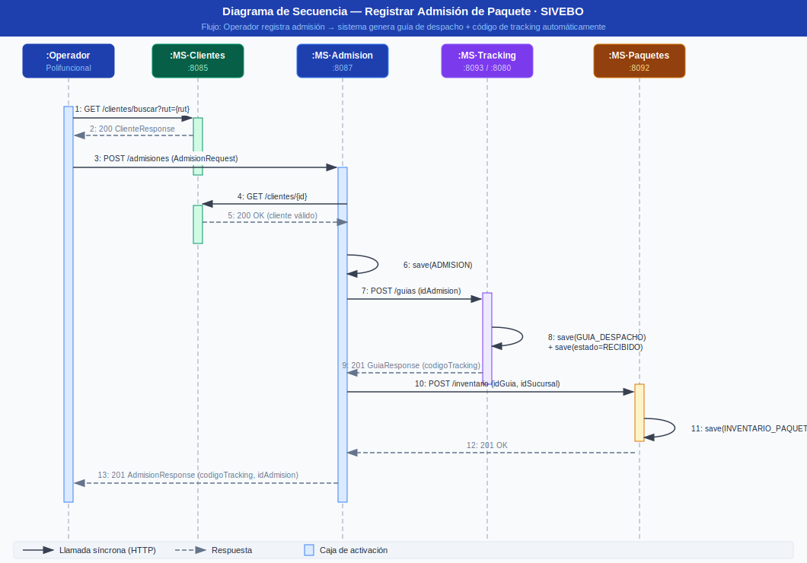
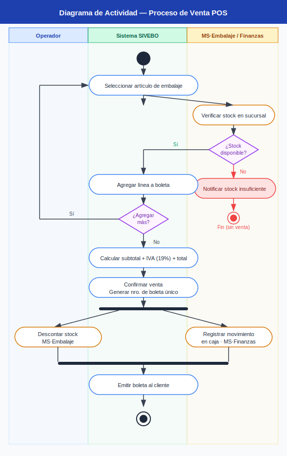
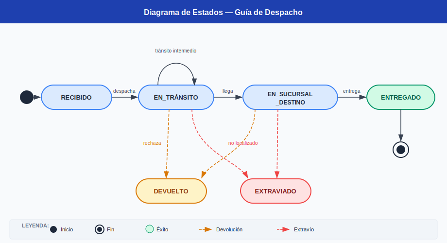
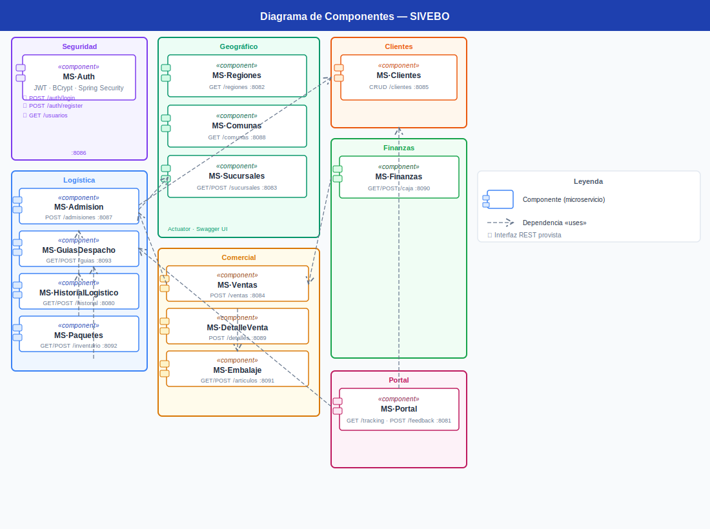
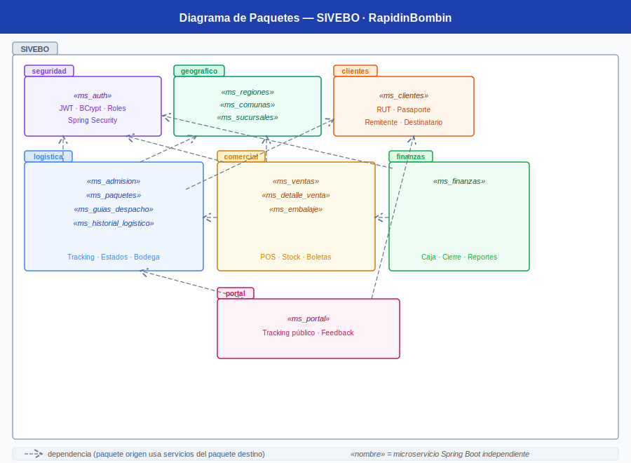
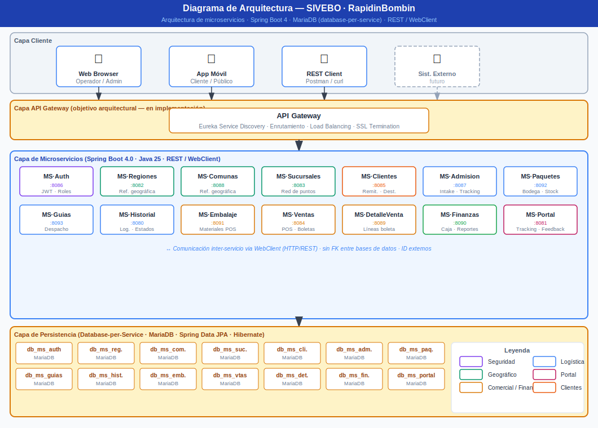

# SIVEBO - Sistema de Ventas y Bodega
# PROPUESTA DE PROYECTO

**Sistema POS Integral para Operadores Polifuncionales - SIVEBO**

Fecha: Abril 2025
Última actualización del modelo de datos: Junio 2026

---

## 1. Definición del Negocio y Problemática

### 1.1 Contexto de la Empresa

SIVEBO es una empresa de logística con presencia en múltiples sucursales, cuya operación diaria depende de operadores polifuncionales. Estos trabajadores son responsables de ejecutar una amplia variedad de tareas críticas para el funcionamiento del negocio.

### 1.2 Funciones del Operador Polifuncional

- Admisión y recepción de paquetería entrante
- Manejo del inventario de paquetes recepcionados y despachados
- Control del inventario de materiales de embalaje
- Venta de embalaje y servicios adicionales a los clientes
- Gestión de las finanzas de la sucursal (caja, cierre, reportes)

### 1.3 Descripción del Problema

La empresa busca un sistema integrado para los operadores polifuncionales. Debido a la gran cantidad de funciones, la empresa busca que el operador interactúe a través de una única interfaz unificada, rápida y fácil de aprender para atender un alto volumen de clientes. Los problemas actuales incluyen la fragmentación de herramientas, la elevada curva de aprendizaje, la falta de trazabilidad integral y el riesgo de errores financieros.

---

## 2. Solución Propuesta

| Solución | Descripción | Ventajas | Desventajas |
| --- | --- | --- | --- |
| **Sistema POS Integral con Microservicios** | Desarrollo de un sistema web unificado basado en arquitectura de microservicios con Spring Boot. Cada funcionalidad opera como un servicio independiente con su propia base de datos MariaDB, comunicados mediante API REST y WebClient. | Alta escalabilidad. Fácil mantenimiento por módulos. Alineado con directrices académicas de 3er semestre. | Mayor complejidad inicial. Requiere coordinación y API Gateway. |

---

## 3. Arquitectura de Microservicios

El sistema se desarrollará obligatoriamente utilizando **Spring Boot** y estará compuesto por un **API Gateway (Eureka)** para la gestión de peticiones y los siguientes 10 microservicios independientes:

- **MS-01 Auth & Usuarios:** Gestión de login, tokens de sesión, encriptación de contraseñas y roles (Admin, Operador, Cliente).
- **MS-02 Sucursales:** Configuración y administración de la red de sucursales.
- **MS-03 Admisión de Paquetes:** Registro de ingreso, sucursal de origen y destino, generación de número de tracking.
- **MS-04 Tracking & Logística:** Control de estados (recibido, en tránsito, entregado) con historial completo por guía.
- **MS-05 Inventario de Paquetes:** Stock de paquetes recepcionados y despachados por sucursal.
- **MS-06 Inventario de Embalaje:** Control de materiales de embalaje y stock por sucursal.
- **MS-07 Ventas / POS:** Venta de embalaje y servicios de envío, generación de boletas.
- **MS-08 Finanzas:** Apertura y cierre de caja, movimientos y reportes de ventas.
- **MS-09 Clientes:** Registro de remitentes y destinatarios con tipo de documento.
- **MS-10 Portal Cliente:** Consulta pública de tracking y feedback de calificación.

### Puertos de cada microservicio

| MS | Nombre | Directorio | Puerto | Descripción |
| --- | --- | --- | --- | --- |
| Infra | API Gateway | `api_gateway/` | **8080** | Punto de entrada único, enrutamiento de peticiones |
| Infra | Eureka Server | `eureka_server/` | **8761** | Service registry y descubrimiento de servicios |
| MS-01 | Auth & Usuarios | `ms_auth/` | **8001** | Login, tokens JWT, roles |
| MS-02 | Sucursales | `ms_sucursales/` | **8002** | Red de sucursales, comunas y regiones |
| MS-03 | Admisión de Paquetes | `ms_admision/` | **8003** | Ingreso de carga y generación de guía |
| MS-04 | Tracking & Logística | `ms_tracking/` | **8004** | Estados y historial de guías de despacho |
| MS-05 | Inventario de Paquetes | `ms_paquetes/` | **8005** | Stock de envíos en bodega por sucursal |
| MS-06 | Inventario de Embalaje | `ms_embalaje/` | **8006** | Artículos de embalaje, categorías y stock |
| MS-07 | Ventas / POS | `ms_ventas/` | **8007** | Punto de venta, boletas y detalles |
| MS-08 | Finanzas | `ms_finanzas/` | **8008** | Caja, apertura/cierre y movimientos |
| MS-09 | Clientes | `ms_clientes/` | **8009** | Remitentes y destinatarios |
| MS-10 | Portal Cliente | `ms_portal/` | **8010** | Consulta pública de tracking y feedback |

---

## 4. Requerimientos Funcionales

Los requerimientos funcionales describen las capacidades que el sistema debe proveer para satisfacer las necesidades del negocio. Se identifican por módulo y se priorizan según su criticidad operacional.

**Prioridades:** `Alta` — bloquea la operación si no existe · `Media` — impacta la eficiencia · `Baja` — mejora la experiencia.

---

### RF-01 al RF-05 · Autenticación y Gestión de Usuarios (MS-01)

| ID | Descripción | Actor | Prioridad |
| --- | --- | --- | --- |
| RF-01 | El sistema debe permitir el inicio de sesión mediante usuario y contraseña, retornando un token JWT válido. | Operador / Admin | Alta |
| RF-02 | El sistema debe permitir al Admin registrar nuevos usuarios, asignándoles un rol y una sucursal. | Admin | Alta |
| RF-03 | El sistema debe restringir el acceso a recursos según el rol del usuario autenticado (Admin, Operador, Cliente). | Sistema | Alta |
| RF-04 | El sistema debe permitir cerrar sesión, invalidando el token JWT activo. | Operador / Admin | Media |
| RF-05 | El sistema debe permitir al Admin crear, editar y listar roles disponibles. | Admin | Media |

---

### RF-06 al RF-09 · Gestión de la Red de Sucursales (MS-02)

| ID | Descripción | Actor | Prioridad |
| --- | --- | --- | --- |
| RF-06 | El sistema debe permitir crear, editar y desactivar sucursales, asociándolas a una comuna y región. | Admin | Alta |
| RF-07 | El sistema debe proveer un listado de sucursales activas, filtrable por región y comuna. | Operador / Admin | Alta |
| RF-08 | El sistema debe mantener el catálogo de regiones de Chile como datos maestros de solo lectura. | Sistema | Alta |
| RF-09 | El sistema debe mantener el catálogo de comunas asociadas a cada región como datos maestros. | Sistema | Alta |

---

### RF-10 al RF-13 · Gestión de Clientes (MS-09)

| ID | Descripción | Actor | Prioridad |
| --- | --- | --- | --- |
| RF-10 | El sistema debe permitir registrar un cliente (remitente o destinatario) con nombre, apellido, tipo y número de documento. | Operador | Alta |
| RF-11 | El sistema debe permitir buscar un cliente existente por tipo y número de documento (RUT, Pasaporte, etc.). | Operador | Alta |
| RF-12 | El sistema debe permitir actualizar los datos de contacto de un cliente (email, teléfono). | Operador | Media |
| RF-13 | El sistema debe listar clientes registrados, con paginación y filtro por nombre o número de documento. | Admin | Baja |

---

### RF-14 al RF-17 · Admisión de Paquetes (MS-03)

| ID | Descripción | Actor | Prioridad |
| --- | --- | --- | --- |
| RF-14 | El sistema debe permitir registrar la admisión de un paquete indicando remitente, destinatario, tipo de carga y peso. | Operador | Alta |
| RF-15 | Toda admisión debe registrar obligatoriamente la sucursal de origen y la sucursal de destino. | Sistema | Alta |
| RF-16 | Al registrar una admisión, el sistema debe generar automáticamente una guía de despacho con código de tracking único. | Sistema | Alta |
| RF-17 | El sistema debe permitir consultar las admisiones realizadas en una sucursal, filtrables por fecha y tipo de carga. | Operador / Admin | Media |

---

### RF-18 al RF-21 · Tracking y Logística (MS-04)

| ID | Descripción | Actor | Prioridad |
| --- | --- | --- | --- |
| RF-18 | El sistema debe permitir registrar un cambio de estado de una guía (Recibido, En Tránsito, Entregado, etc.), identificando la sucursal y el usuario que realiza el movimiento. | Operador | Alta |
| RF-19 | El sistema debe mostrar el historial completo de estados de una guía, ordenado cronológicamente. | Operador / Cliente | Alta |
| RF-20 | El sistema debe exponer el estado actual de una guía (último estado registrado en el historial). | Operador / Cliente | Alta |
| RF-21 | El estado inicial de toda guía recién creada debe ser `Recibido`, registrado de forma automática al momento de la admisión. | Sistema | Alta |

---

### RF-22 al RF-24 · Inventario de Paquetes en Bodega (MS-05)

| ID | Descripción | Actor | Prioridad |
| --- | --- | --- | --- |
| RF-22 | El sistema debe registrar el ingreso de un paquete a la bodega de una sucursal, asociándolo a su guía de despacho. | Operador | Alta |
| RF-23 | El sistema debe registrar la salida de un paquete de la bodega, marcando su fecha de egreso. | Operador | Alta |
| RF-24 | El sistema debe permitir consultar el stock de paquetes actualmente en bodega por sucursal. | Operador / Admin | Media |

---

### RF-25 al RF-29 · Inventario de Materiales de Embalaje (MS-06)

| ID | Descripción | Actor | Prioridad |
| --- | --- | --- | --- |
| RF-25 | El sistema debe permitir crear, editar y desactivar artículos de embalaje, asociándolos a una categoría y con precio de venta. | Admin | Alta |
| RF-26 | El sistema debe permitir gestionar las categorías de embalaje (Cajas, Sobres, Cintas, etc.). | Admin | Media |
| RF-27 | El sistema debe mostrar el stock disponible de cada artículo de embalaje por sucursal. | Operador | Alta |
| RF-28 | El sistema debe descontar automáticamente del stock de la sucursal los artículos vendidos al confirmar una venta. | Sistema | Alta |
| RF-29 | El sistema debe impedir la venta de un artículo de embalaje si el stock disponible en la sucursal es insuficiente para cubrir la cantidad solicitada. | Sistema | Alta |

---

### RF-30 al RF-35 · Ventas y Punto de Venta POS (MS-07)

| ID | Descripción | Actor | Prioridad |
| --- | --- | --- | --- |
| RF-30 | El sistema debe permitir registrar una venta con uno o más artículos de embalaje, calculando subtotal, IVA (19%) y total automáticamente. | Operador | Alta |
| RF-31 | El sistema debe permitir incluir en una misma boleta líneas de embalaje y líneas de servicio de envío (vinculadas a una admisión). | Operador | Alta |
| RF-32 | El sistema debe generar un número de boleta único e irrepetible por cada venta confirmada. | Sistema | Alta |
| RF-33 | El sistema debe registrar el precio unitario histórico de cada artículo al momento de la venta, independiente de cambios futuros en el catálogo. | Sistema | Alta |
| RF-34 | Solo un usuario con rol `Admin` o `Supervisor` puede anular una venta ya registrada, cambiando su estado a `ANULADA`. | Admin / Supervisor | Alta |
| RF-35 | El sistema debe permitir consultar las ventas realizadas en una sucursal, filtrables por rango de fecha y estado. | Operador / Admin | Media |

---

### RF-36 al RF-40 · Finanzas y Gestión de Caja (MS-08)

| ID | Descripción | Actor | Prioridad |
| --- | --- | --- | --- |
| RF-36 | El sistema debe permitir abrir la caja de una sucursal ingresando el monto inicial de efectivo disponible. | Operador | Alta |
| RF-37 | El sistema debe registrar automáticamente cada venta confirmada como un movimiento de ingreso en la caja activa de la sucursal. | Sistema | Alta |
| RF-38 | El sistema debe permitir registrar egresos manuales de caja con descripción del concepto. | Operador | Media |
| RF-39 | El sistema debe permitir cerrar la caja de una sucursal, registrando el monto final y cuadrando los movimientos contra las ventas del periodo. | Operador / Admin | Alta |
| RF-40 | El sistema debe generar un reporte de cierre de caja con detalle de ingresos, egresos, total vendido y diferencia de cuadre. | Admin | Media |

---

### RF-41 al RF-43 · Portal de Autoatención Cliente (MS-10)

| ID | Descripción | Actor | Prioridad |
| --- | --- | --- | --- |
| RF-41 | El sistema debe permitir a cualquier persona consultar el estado de un envío ingresando el código de tracking, sin necesidad de autenticación. | Cliente / Público | Alta |
| RF-42 | El sistema debe registrar cada consulta pública de tracking, incluyendo la IP del solicitante y si el código fue encontrado o no. | Sistema | Media |
| RF-43 | El sistema debe permitir registrar feedback de calificación (escala 1 a 5) sobre un envío, con comentario opcional y sin exigir identificación del cliente. | Cliente / Público | Media |

---

## 5. Historias de Usuario

Las historias de usuario describen las necesidades del negocio desde la perspectiva de cada actor del sistema, siguiendo el formato: **"Como [rol], quiero [acción], para [beneficio]."**

---

### Operador Polifuncional

| ID | Historia de Usuario |
| --- | --- |
| US-01 | Como **operador**, quiero iniciar sesión con mis credenciales, para acceder al sistema con los permisos de mi rol y sucursal asignada. |
| US-02 | Como **operador**, quiero buscar un cliente existente por RUT o número de documento antes de registrar una admisión, para evitar duplicar registros en el sistema. |
| US-03 | Como **operador**, quiero registrar un nuevo cliente directamente durante la atención, para no interrumpir el flujo cuando el cliente es nuevo. |
| US-04 | Como **operador**, quiero registrar la admisión de un paquete indicando remitente, destinatario, tipo de carga, peso y sucursales de origen y destino, para dar inicio formal al proceso logístico del envío. |
| US-05 | Como **operador**, quiero que el sistema genere automáticamente un código de tracking y una guía de despacho al confirmar una admisión, para entregar el comprobante al cliente sin pasos adicionales. |
| US-06 | Como **operador**, quiero registrar el cambio de estado de una guía (Recibido, En Tránsito, Entregado…) indicando la sucursal actual, para mantener el historial logístico vigente en todo momento. |
| US-07 | Como **operador**, quiero consultar el stock de artículos de embalaje disponibles en mi sucursal antes de atender al cliente, para ofrecer solo lo que efectivamente tengo. |
| US-08 | Como **operador**, quiero registrar una venta que incluya artículos de embalaje y/o el cobro del servicio de envío en una misma boleta, para cerrar la transacción completa en un solo paso. |
| US-09 | Como **operador**, quiero que el sistema calcule automáticamente el subtotal, IVA (19%) y total de cada venta, para eliminar errores de cálculo manual en caja. |
| US-10 | Como **operador**, quiero que el sistema me impida confirmar una venta si el stock del artículo solicitado es insuficiente en mi sucursal, para no generar compromisos que no puedo cumplir. |
| US-11 | Como **operador**, quiero registrar el ingreso de un paquete a la bodega de mi sucursal asociándolo a su guía, para llevar el control físico del inventario en tiempo real. |
| US-12 | Como **operador**, quiero registrar la salida de un paquete de bodega cuando es despachado, para reflejar el egreso y mantener el inventario exacto. |
| US-13 | Como **operador**, quiero abrir la caja de mi sucursal al inicio del turno ingresando el monto inicial de efectivo, para habilitar el registro de ventas y movimientos del día. |
| US-14 | Como **operador**, quiero cerrar la caja al final de mi turno declarando el monto final contado, para cuadrar los movimientos y entregar el turno con respaldo. |

---

### Administrador

| ID | Historia de Usuario |
| --- | --- |
| US-15 | Como **administrador**, quiero registrar nuevos usuarios en el sistema asignándoles rol y sucursal, para controlar quién puede operar cada punto de la red. |
| US-16 | Como **administrador**, quiero crear, editar y desactivar sucursales asociadas a una región y comuna, para mantener actualizada la red de puntos de atención. |
| US-17 | Como **administrador**, quiero gestionar el catálogo de artículos de embalaje con sus categorías y precios de venta, para mantener la oferta comercial vigente. |
| US-18 | Como **administrador**, quiero anular una venta ya registrada, para corregir errores de facturación sin eliminar el registro del historial. |
| US-19 | Como **administrador**, quiero consultar las ventas de cualquier sucursal filtrando por rango de fechas y estado, para monitorear el desempeño comercial de la red. |
| US-20 | Como **administrador**, quiero revisar el reporte de cierre de caja de cada sucursal con detalle de ingresos, egresos y diferencia de cuadre, para auditar la gestión financiera diaria. |

---

### Cliente / Público General

| ID | Historia de Usuario |
| --- | --- |
| US-21 | Como **cliente**, quiero consultar el estado de mi envío ingresando el código de tracking en el portal público, para saber dónde se encuentra mi paquete sin necesidad de acudir a una sucursal ni llamar por teléfono. |
| US-22 | Como **cliente**, quiero ver el historial completo de estados por los que ha pasado mi envío, para tener trazabilidad total del recorrido de mi paquete. |
| US-23 | Como **cliente**, quiero calificar el servicio recibido con una nota del 1 al 5 y un comentario opcional una vez entregado mi envío, para dar retroalimentación a la empresa sobre mi experiencia. |
| US-24 | Como **cliente**, quiero poder dejar mi calificación sin necesidad de identificarme, para dar mi opinión de forma anónima si así lo prefiero. |

---

## 6. Desacoplamiento y Principios Técnicos

- **Comunicación:** Interacción mediante **API REST** y consultas de datos utilizando **WebClient**. Los microservicios estarán completamente desacoplados.
- **API Gateway:** Implementación de **Eureka** (u otro equivalente) para el enrutamiento y registro de servicios.
- **Database per Service:** Cada microservicio tiene su propia base de datos MariaDB independiente. Las referencias entre servicios se implementan mediante **ID externos (Ref Ext)** sin FK formal entre bases de datos. La integridad referencial entre servicios es responsabilidad de la capa de aplicación.
- **Motor de Base de Datos:** **MariaDB**, con modelo relacional en **Tercera Forma Normal (3FN)**, `AUTO_INCREMENT` para autoincremento y constraints de negocio declarados explícitamente.
- **Patrón de Diseño:** Implementación del patrón **CSR (Controller-Service-Repository)** y uso de **DTOs**.
- **Documentación de API:** Cada microservicio integra **SpringDoc OpenAPI (Swagger UI)** para la documentación interactiva de sus endpoints REST.

---

## 7. Seguridad Básica

El MS-01 implementará mecanismos de seguridad que incluyen:

- Encriptación de contraseñas antes del almacenamiento (`CHAR(60)`, compatible con bcrypt).
- Autenticación de usuarios y generación de tokens de sesión (JWT) en el login.
- Validación de accesos según los roles definidos (Admin, Operador, Cliente).

---

## 8. Estructura de Datos — Entidades por Microservicio

El modelo de datos fue normalizado a **Tercera Forma Normal (3FN)**. Cada microservicio tiene su propio archivo DDL MariaDB en la carpeta `/ddl/`.

### Convenciones

| Sufijo | Significado |
| --- | --- |
| `PK` | Clave primaria (`INT` / `BIGINT` + `AUTO_INCREMENT`) |
| `UK` | Restricción de unicidad |
| `FK` | Clave foránea interna (dentro del mismo microservicio) |
| `Ref Ext` | Referencia externa a otro microservicio (solo el ID, sin FK formal) |
| `?` | Campo nullable |

---

### MS-01 · db_ms_auth — Usuarios y Seguridad

| Entidad | Atributos |
| --- | --- |
| `ROL` | id_rol `PK`, nombre_rol `UK`, descripcion |
| `USUARIO` | id_usuario `PK`, username `UK`, password_hash `CHAR(60)`, email `UK`, id_rol `FK`, id_sucursal_asignada `Ref Ext`·`?`, activo, created_at |
| `TOKEN_SESION` | id_token `PK`, id_usuario `FK`, token `UK`, fecha_expiracion, created_at |

**Ref Ext:** `USUARIO.id_sucursal_asignada` → `db_ms_sucursales.SUCURSAL`

---

### MS-02 · db_ms_sucursales — Configuración de Red

| Entidad | Atributos |
| --- | --- |
| `REGION` | id_region `PK`, nombre_region `UK` |
| `COMUNA` | id_comuna `PK`, nombre_comuna `UK`, id_region `FK` |
| `SUCURSAL` | id_sucursal `PK`, nombre_sucursal `UK`, id_comuna `FK`, direccion_fisica `UK`, telefono_contacto `UK`·`?`, estado |

**Ref Ext:** Ninguna. Fuente de verdad de la red geográfica.

---

### MS-03 · db_ms_admision — Ingreso de Carga

| Entidad | Atributos |
| --- | --- |
| `TIPO_CARGA` | id_tipo `PK`, nombre_tipo `UK` (Documento, Encomienda…), descripcion |
| `ADMISION` | id_admision `PK`, id_cliente_rem `Ref Ext`, id_cliente_dest `Ref Ext`, id_sucursal_origen `Ref Ext`, id_sucursal_dest `Ref Ext`, id_tipo `FK`, peso_kg, fecha_creacion, id_usuario_reg `Ref Ext` |

**Ref Ext:** `id_cliente_rem` / `id_cliente_dest` → `db_ms_clientes.CLIENTE` · `id_sucursal_origen` / `id_sucursal_dest` → `db_ms_sucursales.SUCURSAL` · `id_usuario_reg` → `db_ms_auth.USUARIO`

---

### MS-04 · db_ms_tracking — Logística y Estados

| Entidad | Atributos |
| --- | --- |
| `ESTADO_MAESTRO` | id_estado `PK`, nombre_estado `UK` (Recibido, En Tránsito, Entregado…), orden |
| `GUIA_DESPACHO` | id_guia `PK`, codigo_tracking `UK`, id_admision `Ref Ext`, fecha_creacion |
| `HISTORIAL_LOGISTICO` | id_hist `PK`, id_guia `FK`, id_estado `FK`, id_sucursal_actual `Ref Ext`, id_usuario `Ref Ext`, fecha_hora, comentario`?` |

**Vista:** `V_ESTADO_ACTUAL_GUIA` — estado vigente por guía (último registro del historial).

**Ref Ext:** `GUIA_DESPACHO.id_admision` → `db_ms_admision.ADMISION` · `HISTORIAL_LOGISTICO.id_sucursal_actual` → `db_ms_sucursales.SUCURSAL` · `HISTORIAL_LOGISTICO.id_usuario` → `db_ms_auth.USUARIO`

---

### MS-05 · db_ms_inv_paquetes — Stock de Envíos en Bodega

| Entidad | Atributos |
| --- | --- |
| `INVENTARIO_PAQUETE` | id_inv `PK`, id_guia `Ref Ext`, id_sucursal `Ref Ext`, fecha_ingreso, fecha_salida`?` |

> **Nota de diseño:** La entidad `UBICACION_BODEGA` fue eliminada por no corresponder a un concepto del negocio. La ubicación física de un paquete queda expresada únicamente por la sucursal donde está almacenado.

**Ref Ext:** `id_guia` → `db_ms_tracking.GUIA_DESPACHO` · `id_sucursal` → `db_ms_sucursales.SUCURSAL`

---

### MS-06 · db_ms_inv_embalaje — Materiales de Venta

| Entidad | Atributos |
| --- | --- |
| `CATEGORIA_EMBALAJE` | id_cat `PK`, nombre_categoria `UK` (Cajas, Sobres…) |
| `ARTICULO_EMBALAJE` | id_art `PK`, id_cat `FK`, nombre, descripcion`?`, precio_vta, activo |
| `STOCK_SUCURSAL` | id_stock `PK`, id_art `FK`, id_sucursal `Ref Ext`, cantidad_disponible, updated_at · `UK(id_art, id_sucursal)` |

**Ref Ext:** `STOCK_SUCURSAL.id_sucursal` → `db_ms_sucursales.SUCURSAL`

---

### MS-07 · db_ms_ventas — Transacciones POS

| Entidad | Atributos |
| --- | --- |
| `VENTA` | id_venta `PK`, nro_boleta `UK`, id_usuario `Ref Ext`, id_sucursal `Ref Ext`, fecha_vta, subtotal, iva, total, estado |
| `DETALLE_VENTA` | id_det `PK`, id_venta `FK`, id_articulo `Ref Ext`, id_admision `Ref Ext`·`?`, cantidad_art, precio_unit_historico_art, precio_admision`?` |

> **Nota de diseño:** `DETALLE_VENTA` permite registrar tanto líneas de embalaje como líneas de servicio de envío en la misma boleta. `id_admision` y `precio_admision` son nullable cuando la línea corresponde solo a embalaje.

**Ref Ext:** `VENTA.id_usuario` → `db_ms_auth.USUARIO` · `VENTA.id_sucursal` → `db_ms_sucursales.SUCURSAL` · `DETALLE_VENTA.id_articulo` → `db_ms_inv_embalaje.ARTICULO_EMBALAJE` · `DETALLE_VENTA.id_admision` → `db_ms_admision.ADMISION`

---

### MS-08 · db_ms_finanzas — Caja y Reportes

| Entidad | Atributos |
| --- | --- |
| `CAJA_SUCURSAL` | id_caja `PK`, id_sucursal `Ref Ext` `UK`, estado_actual |
| `APERTURA_CIERRE` | id_sesion `PK`, id_caja `FK`, id_usuario `Ref Ext`, monto_apertura, monto_cierre`?`, fecha_hora_ap, fecha_hora_ci`?` |
| `MOVIMIENTO_CAJA` | id_mov `PK`, id_sesion `FK`, tipo (INGRESO/EGRESO), monto, id_venta `Ref Ext`·`?`, concepto`?` |

**Ref Ext:** `CAJA_SUCURSAL.id_sucursal` → `db_ms_sucursales.SUCURSAL` · `APERTURA_CIERRE.id_usuario` → `db_ms_auth.USUARIO` · `MOVIMIENTO_CAJA.id_venta` → `db_ms_ventas.VENTA`

---

### MS-09 · db_ms_clientes — Base de Datos de Personas

| Entidad | Atributos |
| --- | --- |
| `TIPO_DOCUMENTO` | id_tipo_doc `PK`, codigo `UK` (RUT, Pasaporte…), descripcion |
| `CLIENTE` | id_cliente `PK`, id_tipo_doc `FK`, nro_documento `UK`, nombre, apellido, email`?`, telefono`?` |

**Ref Ext:** Ninguna. Fuente de verdad de personas.

---

### MS-10 · db_ms_portal — Consultas Públicas y Feedback

| Entidad | Atributos |
| --- | --- |
| `CONSULTA_PUBLICA` | id_cons `PK`, codigo_tracking_consultado, id_guia `Ref Ext`·`?`, ip_usuario, fecha_hora |
| `FEEDBACK_CLIENTE` | id_feed `PK`, id_guia `Ref Ext`, id_cliente `Ref Ext`·`?`, calificacion (1–5), comentario`?`, fecha_hora |

**Vista:** `V_CONSULTA_PUBLICA` — expone `guia_encontrada` como booleano derivado de `id_guia IS NOT NULL`.

**Ref Ext:** `id_guia` → `db_ms_tracking.GUIA_DESPACHO` · `FEEDBACK_CLIENTE.id_cliente` → `db_ms_clientes.CLIENTE`

---

## 9. Reglas de Negocio

- **Control de Stock:** No se puede realizar una venta en MS-07 si MS-06 indica stock insuficiente del artículo de embalaje solicitado.
- **Generación de Tracking:** Todo paquete admitido en MS-03 debe generar automáticamente una `GUIA_DESPACHO` con un estado inicial en MS-04.
- **Registro de Destino:** Toda admisión debe registrar explícitamente la sucursal de origen (`id_sucursal_origen`) y la sucursal de destino (`id_sucursal_dest`).
- **Cierre de Caja:** MS-08 debe cuadrar las ventas registradas en MS-07 antes de permitir el cierre de sesión de caja.
- **Validación de Roles:** Solo un usuario con rol `Admin` o `Supervisor` puede anular una venta (cambiar `estado` a `ANULADA`).
- **Feedback anónimo:** MS-10 permite registrar feedback sin identificar al cliente (`id_cliente` nullable). Si el `codigo_tracking_consultado` no existe, `id_guia` queda `NULL` en `CONSULTA_PUBLICA`.
- **Una caja por sucursal:** La restricción `UNIQUE(id_sucursal)` en `CAJA_SUCURSAL` garantiza que cada sucursal tenga exactamente una caja asignada.

---

## 10. Control de Versiones, Pruebas y Despliegue

- **Repositorio:** Uso obligatorio de **GitHub** para evidenciar el avance progresivo, la participación del equipo, el historial de cambios, y el uso de ramas de desarrollo con commits frecuentes.
- **Pruebas y Documentación:** Se desarrollará documentación técnica del sistema y pruebas unitarias de los módulos principales. Cada microservicio expondrá su API mediante **Swagger UI (SpringDoc OpenAPI)**, accesible en `/swagger-ui.html`, permitiendo explorar y probar los endpoints de forma interactiva.
- **Despliegue:** Despliegue en entorno local exponiendo los servicios a través del API Gateway, dejando el sistema disponible mediante una URL para el consumo de las APIs.

---

## 11. Diagramas UML

### Diagrama de Casos de Uso

### Diagrama de Secuencia — Registrar Admisión de Paquete

### Diagrama de Actividad — Proceso de Venta POS

### Diagrama de Estados — Guía de Despacho

### Diagrama de Componentes

### Diagrama de Paquetes

### Diagrama de Arquitectura

---

